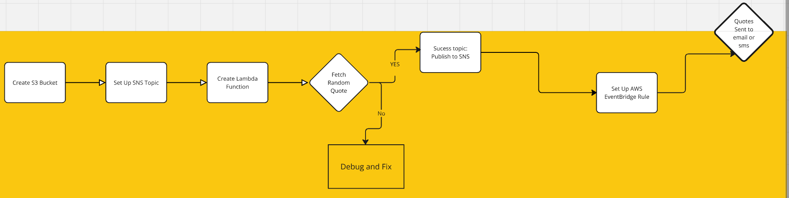
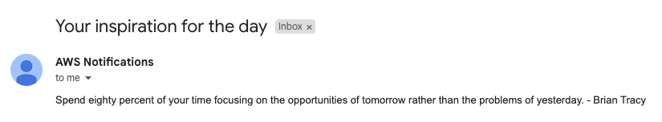

  
Table of Contents 

  <ol>
  <li><a href="#workflow">Workflow</a></li>
    Project</a>
        <ul>
          <li><a href="#about-the-project">About The Project
          <li><a href="#overview">Overview</a></li>
          <li><a href="#key-features">Key Features</a></li>
        </ul>
    </li>
     <li><a href="#technoloy">Technologies Used</a></li>
    <li><a href="#Built With">Built With</a></li>
    <li><a href="#Dependencies">Dependencies</a></li>
    <li><a href="#purpose">Purpose</a></li>
    <li><a href="#result">Result</a></li>
    <li><a href="#article">Article</a></li>
  </ol>

# Goal Manifestation Quote

## Workflow

(<a href="#top">back to top</a>)

### About The Project

This project is an AWS-based workflow designed to inspire and motivate users by sending them scheduled motivational quotes. By using various AWS services, the system fetches random quotes from a public API and delivers them to subscribed users at specific intervals. The purpose of this project is to promote positivity and goal manifestation through automation.

### Overview

* [Repo Codes](https://github.com/r2vichan/lambda-quote-generator)
* [documentation]()

(<a href="#top">back to top</a>)

## **Key features**

- **Amazon S3**: Created this to store my files. Used to store files and resources related to goal manifestation.
- **AWS Lambda**: Executes the function that fetches random quotes from the API and publishes them to an Amazon Simple Notification Service (SNS) topic.
- **Amazon Simple Notification Service (SNS)**: Manages user subscriptions and ensures the delivery of motivational messages via email or SMS to all subscribers.
- **Amazon EventBridge**: Handles the scheduling of the Lambda function, triggering it every Wednesday, and Friday to deliver the quotes automatically.

## **Built With**

- **AWS Lambda**: Serverless computing for processing events.
- **Amazon SNS**: Messaging service for notifications.
- **AWS EventBridge**: Event bus for connecting applications using events.
- **API**: -  Get it at [Zenquotes](https://zenquotes.io/)
- **IAM Security**:

  - Least privilege policies for Lambda, SNS, and EventBridge.

## **Technologies Used**

- Python
- AWS
- REST API

## **Dependencies**

- boto3
- urllib.requests
- os
- json

## Purpose:

This project demonstrates how AWS services can work together to automate workflows and provide valuable content to users. By combining serverless computing, storage, notifications, and scheduling, it ensures a reliable and efficient system for delivering motivational quotes.

(<a href="#top">back to top</a>)

### **Result**

(<a href="#top">back to top</a>)

(<a href="#top">back to top</a>)

